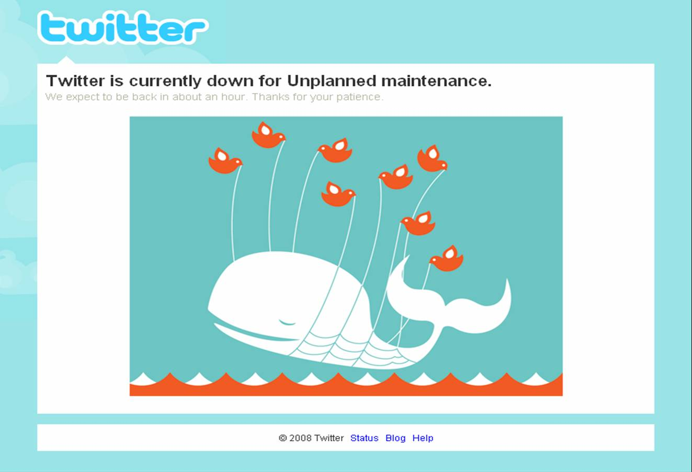
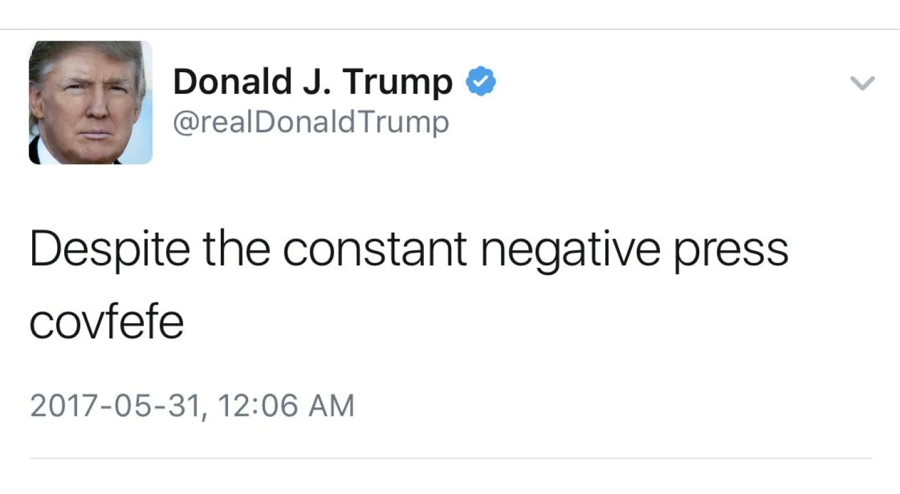
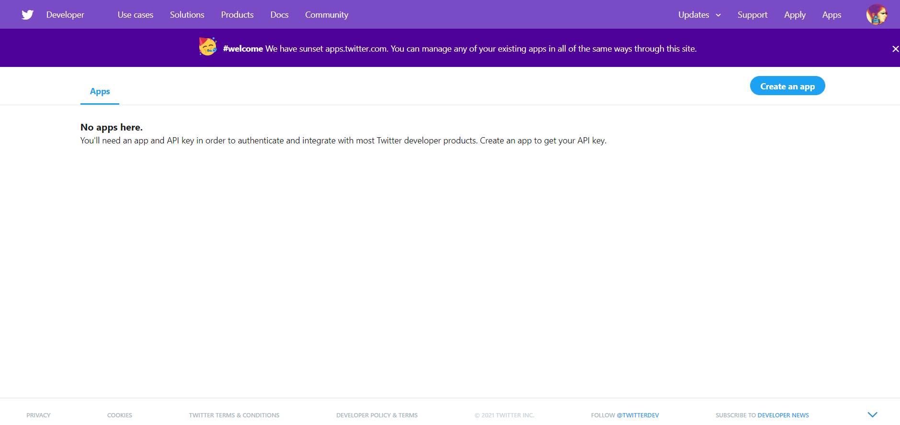
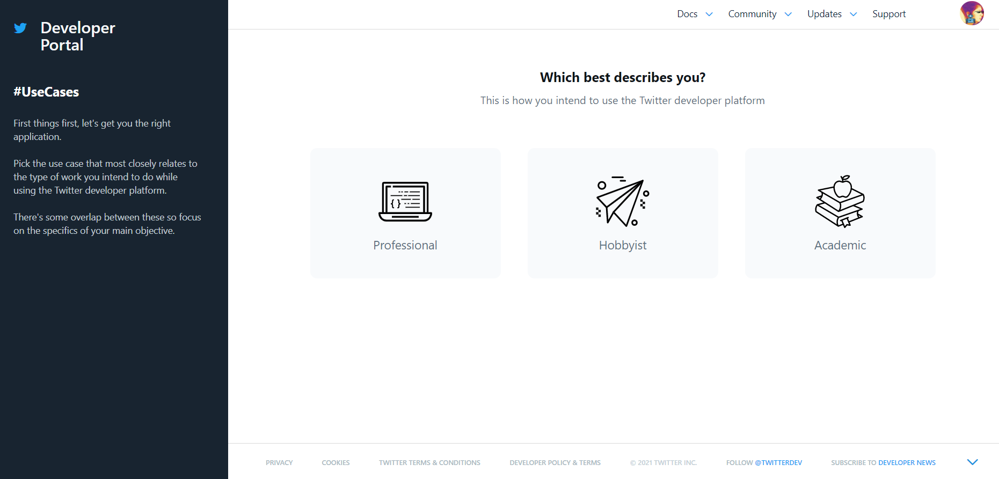
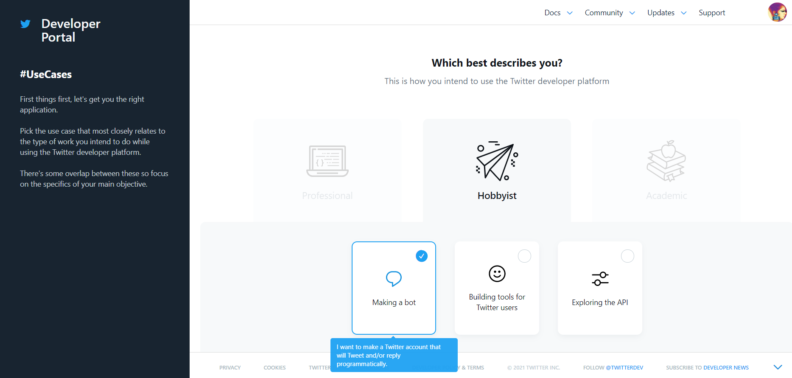
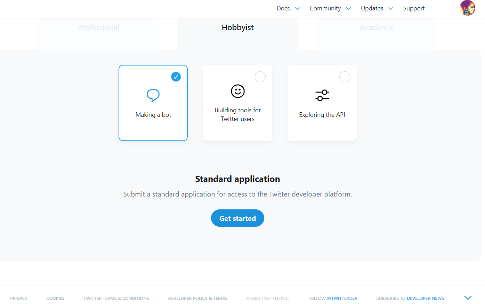
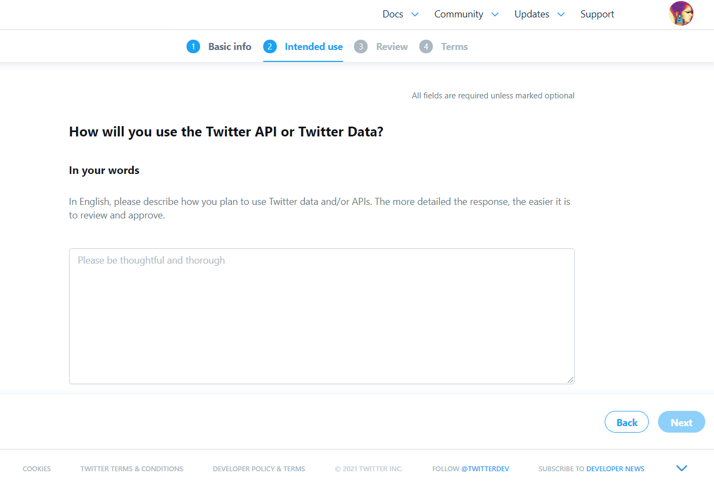
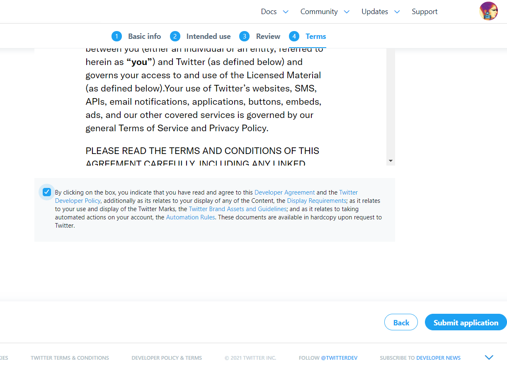
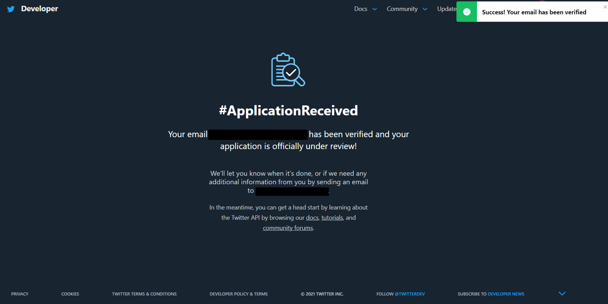
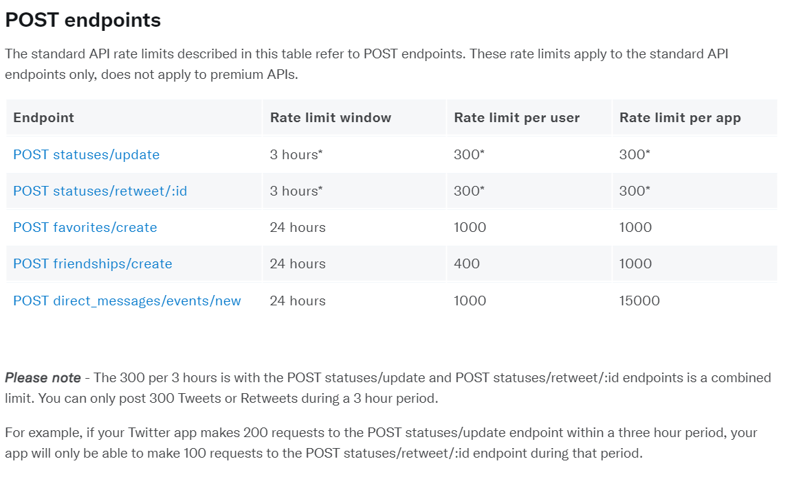

In this article we gonna build a twitter bot in Python with Tweepy, a very nice library to invoke the Twitter API. You will learn how to retrieve data from Twitter and automatize your tweets.

## Twitter

Around 2009 when I create my first Twitter account I remember Twitter still being a place to complain about life with strangers, tell how much depressive you feel, not sharing your user with your family and so on. You were limited to write in 140 characters without any other type of information attached such as photo (unless you used another place to host to your pictures and post the link on Twitter). Yeah, a lot has changed since those old days and everybody can say Twitter is one of the most  popular and not boring social network on nowadays.



Twitter is used today for many things, from voting for awards, promoting protests, drawing the world's attention to some catastrophic situation, sharing memes, FAKE NEWS, revealing talent and even reporting crimes in inaccessible or unsafe places, contributing a lot to journalistic work and of the police.



As it is a place full of users of different ages, but predominantly young, large companies use twitter for advertising, sales and, of course, answering possible complaints about their products in an automated and 'modern' way, full of memes of the moment.


### Badly programmed bot

The growing use of bots is notable from well-programmed ones to big flops. As in the case of the Brazilian company Decolar, which responded to the user by referring to him/her through his 'nickname', which was a loophole for people to put insults in his name and make the company's official profile tweet the insult when responding, the user changed its nickname and printed the company tweet like: "wow free insults";


Translated tweet: *"Ok, selena gomez is not an artist.. Our team is working to offer your all the possible alternatives."*

Something very important for the visibility of your brand, profile, account is engagement and to have it you must keep your account always active. You can do this manually or rest with the use of a Twitter bot.

## Twitter API

With this API you are able to retrieve, analyze data, write tweets programmatically.

> The Twitter API provides the tools you need to contribute to, engage with, and analyze the conversation happening on Twitter.

To start our bot, first of all you need to create (if you don't have one) a twitter account and then you must apply for a developer account to have your user case approved. 

After that you have to create a Twitter Application through [Twitter API for developers website](https://apps.twitter.com/app/new). 

##### Create an App



##### Choose type of app



I've chose the type hobbyist for the bot.



##### Getting started

Submit a standard application for access to the Twitter developer plataform



##### Describe your app

Describe how you will use Twitter data and/or APIs. For example, you can say: 
***"I will dedicate this bot to test the auto replying to tag and comments, auto retweet and like status with the name of Pelé."*** or whatever you like to use.



##### Submit your application

Accept the terms and submit your application.



##### Verify your email

You need to verify your email and confirm to complete your application, after that your application will be reviewed. You will have to wait until there.



When your application is approved you will be provided with a set of credentials that you will use to authenticate all requests to the API. Those are:

* **API Key** - This is essentially a username, and allows you to make a request on behalf of your App.
* **API Key Secret** - This is a password, and allows you to make a request on behalf of your App.
* **Access Token** - This token represents the Twitter account that owns the App, and allows you to make a request on behalf of that Twitter account. 
* **Access Token Secret** - This token also represents the Twitter account that owns the App, and allows you to make a request on behalf of that Twitter account. 
* **Bearer Token** - This token represents your App and enables you to authenticate requests that require [OAuth 2.0 Bearer Token](https://developer.twitter.com/en/docs/authentication/oauth-2-0) authentication. 

We are not going to use the Bearer Token on this tutorial.

With Twitter API we will have access to a lot of endpoints and public user's information such as:  

**Tweets, Retweets, Likes, Trends, Media**. As we will also have the right to tweet, retweet, like, send direct messages.

### Rate Limit

Twitter API limits the number of requests a developer can make during a period, so you will have to take this in consideration when writing your bot. If you pass this limit your Twitter bot will be blocked during a time or even stopped to run.

For example, Twitter API allows you to make **2400 tweet updates** by day in intervals of 30 minutes in your application (**Retweets are also counted as tweets**). Also **1000 messages of direct message**. Follow limit of **400 follows** by day and etc.  

You can check all the types of Rate Limit here: [Twitter API rate limit](https://developer.twitter.com/en/docs/rate-limits).

## Tweepy

We are going to use the Python library Tweepy to automatize our twitter bot. 

> The API class provides access to the entire twitter RESTful API methods. Each method can accept various parameters and return responses. For more information about these methods please refer to API Reference.

### Installation

You can install Tweepy through the following command:

`pip install tweepy`

Particularly I use virtual environment to install my python libraries and packages not globally, if you don't know how to use it go back to the beginning of the last article here: [JWT Login Flask](https://patriciadourado.com/frompat/jwt-login-flask/).

## dotenv

To not expose our credentials when eventually pushing to a public repository I recommend the use of the module [dotenv](https://www.npmjs.com/package/dotenv) and our sensitive data in a .env file like:

```
CONSUMER_KEY = 'YOUR API KEY'
CONSUMER_SECRET = 'YOUR SECRET KEY'
KEY = 'YOUR ACCESS TOKEN'
SECRET = 'YOUR SECRET'
```

> Dotenv is a zero-dependency module that loads environment variables from a .env file into process.env. Storing configuration in the environment separate from code is based on The Twelve-Factor App methodology.

### Installation

You can install dotenv through pip with the following command:

`pip install python-dotenv`

### First Tweet!

* **Import libraries and load env variables** - First of all we are going to import all the necessary libraries we will use:

```python
import os
import tweepy
import time
import logging
from dotenv import load_dotenv
```

* **Load env variables** - Then we will load the environment variables from .env file and set the python variables:
  load_dotenv()  # take environment variables from .env:

```python
# API key
CONSUMER_KEY = os.getenv('CONSUMER_KEY')
# API secret key
CONSUMER_SECRET = os.getenv('CONSUMER_SECRET')
# Access token
KEY = os.getenv('KEY')
# Access token secret
SECRET = os.getenv('SECRET')
```

* **Link credentials to Login** - Log with the credentials from our Twitter Application with the OAuth. Twitter requires all requests to use OAuth for authentication:

```python
logging.basicConfig(level=logging.INFO)
logger = logging.getLogger()
auth = tweepy.OAuthHandler(CONSUMER_KEY, CONSUMER_SECRET)
auth.set_access_token(KEY, SECRET)
```

* **Create object API** - We will create a Tweepy API. The API class provides access to the entire twitter RESTful API methods. Each method can accept various parameters and return responses:

```python
api = tweepy.API(auth)
```

* **Update status** - We are going to update our status and tweet our first tweet from the bot!

```python
api.update_status('bot tweeting live!')
```

### Twitter bot is live!

Run the code below to tweet our first tweet with bot!

##### **`bot.py`**

```python
import os
import tweepy
import time
import logging
from dotenv import load_dotenv

load_dotenv()  # take environment variables from .env.

# API key
CONSUMER_KEY = os.getenv('CONSUMER_KEY')
# API secret key
CONSUMER_SECRET = os.getenv('CONSUMER_SECRET')
# Access token
KEY = os.getenv('KEY')
# Access token secret
SECRET = os.getenv('SECRET')

logging.basicConfig(level=logging.INFO)
logger = logging.getLogger()

auth = tweepy.OAuthHandler(CONSUMER_KEY, CONSUMER_SECRET)
auth.set_access_token(KEY, SECRET)

# Create API object
api = tweepy.API(auth)

# First tweet from your bot account!
api.update_status('bot tweeting live!')
```

### Avoid repeated Tweets

To avoid reply or read the same tweets twice or more we are going to use a file with the ID of the last seen tweets:

```python
FILE_NAME = 'last_seen.txt'

def read_last_seen(FILE_NAME):
  file_read = open(FILE_NAME,'r')
  last_seen_id = int(file_read.read().strip())
  file_read.close()
  return last_seen_id

def store_last_seen(FILE_NAME, last_seen_id):
  file_write = open(FILE_NAME,'w')
  file_write.write(str(last_seen_id))
  file_write.close()
  return
```

### Replying Tweets

We are going to use the method `api.update_status` again, but now for replying to users with the most recents tweets with the word 'Brazil' with the message: *"In brazilian portuguese we don't say foreign we say GRINGO and I think that is beautiful!"*

```python
def reply():
  tweets = api.mentions_timeline(read_last_seen(FILE_NAME), tweet_mode = 'extended')

  for tweet in reversed(tweets):
    if 'brazil' in tweet.full_text.lower():
      api.update_status("@" + tweet.user.screen_name + " In brazilian portuguese we don't say foreign we say GRINGO and I think that is beautiful!", tweet.id)
      store_last_seen(FILE_NAME, tweet.id)
```

To invoke the method just add the following line: `reply()` on your python bot.py

### Retweeting Tweets

This time we are going to retweet the first 25 tweets mentioning the word *brazilian*. Note that I used a `time.sleep()` of 900 seconds to run the method `api.retweet()` because of the rate limit imposed by Twitter API. 

```python
def retweet():
  for tweet in api.search(q="brazilian", lang="en", count=25):
    status = api.get_status(tweet.id, tweet_mode = 'extended')
    if not status.retweeted:  # Check if Retweet
      try:
        api.retweet(tweet.id)
      except Exception as e:
        logger.error("Error on retweet", exc_info=True)

while True:
  retweet()
  time.sleep(900)
```

A retweet is considered a POST request, that way in 900 seconds (15 minutes) we will retweet 25 tweets, so in one hour (3600 seconds) we will have retweeted 3600/900 = 4 x 25 tweets = 100 tweets.

Please, observe the rate limit window, per user and app for POST requests:



With this logic we will have exactly 300 retweets in 3 hours.

### Liking Tweets

To favorite/like the tweets we can use the method `api.create_favorite()` like the following:

```python
def favorite():
  for tweet in api.search(q="brazilian", lang="en", count=25):
    status = api.get_status(tweet.id, tweet_mode = 'extended')
    if not status.retweeted:  # Check if Retweet
      try:
        api.create_favorite(tweet.id)
      except Exception as e:
        logger.error("Error on retweet", exc_info=True)
while True:
  favorite()
  time.sleep(900)
```

### Replying and Retweeting Tweets

If we would like to reply and retweet the same tweet we need to pay attention to not have our bot blocked by spamming, it means if we tweet the same thing in a short period the twitter is going to consider it as a spam. 

To get around this we will add an incremental value of i to differentiate the current reply from the previous one.

```python
def retweet(i):
  for tweet in api.search(q="brazilian", lang="en", count=12):
    status = api.get_status(tweet.id, tweet_mode = 'extended')
    if not status.retweeted:  # Check if Retweet
      try:
        i = i + 1
        api.update_status("@" + tweet.user.screen_name + " In brazilian portuguese we don't say foreign we say GRINGO and I think that is beautiful! +"+str(i), tweet.id)
        api.retweet(tweet.id)
      except Exception as e:
        logger.error("Error on retweet", exc_info=True)

i = 0
while True:
  retweet(i)
  time.sleep(900)
```

Note that the number of tweets searched to be replied and retweeted changed to 12 due to the rate limit. If you prefer you can reduce the number of tweets that will be replied and retweeted or increase the time in `time.sleep()` for call the method;

## Thank you!

Hope you enjoyed this article and can build your own Twitter bot! :)