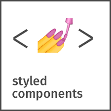

While the front end development is experiencing the modular advantages of components, there are several ways to styling them, as CSS, SASS, CSS Modules, etc. 

I would like to introduce you to my new favorite one: [styled-components](https://styled-components.com/). 



Created by [Max Stoiber](https://mxstbr.com), styled-components is a library that allows you to write CSS code inside Javascript, which means you won't need to import .css file into your page anymore. In addiction to organize your code better, you also have the possibility to reuse the created components in the same project just calling them or in another project just copying the .js file into it.


I had my first experience with styled-components on a ReactJS project I started developing last year. I was presented to this fantastic library through a learning live on **twitch.tv** of an expert front end developer and once I used it I've never wanted to return to the old ways of styling. You will see why!

## Installation

To set up styled-components, run the following command in your project directory:

```
npm install --save styled-components
```

#### Voilà!

The following example creates a simple button component, already styled:

```js
  import styled from "styled-components";

  const Button = styled.button`
    background-color: #3a4042;
    color: #f5f5f5;
    border: 1px solid #f5f5f5;
    border-radius: 4px;
    padding: 0.25em 1em;
    margin: 1em;
    font-size: 20px;
    cursor: pointer;
  `;

  render(
    <Button> 
      Send
    </Button>
  );
```
*The result:*


Now you saw how easy is to styling your component, you must know that **you can style any component!** 

The following example is a modificated one from styled-component website:

```js
const h2 = ({ className, children }) => (
  <a className={className}>
    {children}
  </a>
)

const StyledH2 = styled(h2)`
  color: #db7093;
  font-weight: bold;
`;

render(
  <>
    <h2>Unstyled, boring Title</h2>
    <StyledH2>Styled, exciting Title</StyledH2>
  </>
);
```
*The result:*


You can also pass tag names into the styled() factory call, as "div", "section", not only components.

## Changing based on props

You can also change a component state based on a prop you set and adapt this component to have another style or behavior. 

This example shows how to change the size of the component `Tag` by setting its prop `small` to true.

```js
const Tag = styled.h2`
  font-size: 40px;
  letter-spacing: 2px;
  background-color: #db7093;
  color: #f5f5f5;
  padding: 20px 18px;

  ${({ small }) =>
    small &&
    css`
      font-size: 25px;
      padding: 8px 8px;
    `};
`;

render(
  <div>
    <Tag>Normal Tag</Tag>
    <Tag small>Small tag</Tag>
  </div>
);
```
*Check the result below:*


One of my favorites things in styled-components is how you can pass props of a component to the DOM node that is mounted.

This examples shows how to styled-components passes the prop `categoryColor` with the border color to the `Button` component, if no value is sent by the prop then the default color `#ffba05` is used.

```js
const Button = styled.button`
  color: #000000;
  width: 100px; 
  margin-right: 5px;
  border-radius: 4px;
  border: 4px solid
    ${({ categoryColor }) => categoryColor || "#ffba05"};
`;

render(
  <div>
    <Button>yes</Button>
    <Button categoryColor={"#db7093"}>no</Button>
   </div>
);
```
*Check the result below:*


>Apart from the improved experience for developers, styled-components provides:

* Automatic critical CSS: styled-components keeps track of which components are rendered on a page and injects their styles and nothing else, fully automatically. Combined with code splitting, this means your users load the least amount of code necessary.
* No class name bugs: styled-components generates unique class names for your styles. You never have to worry about duplication, overlap or misspellings.
* Easier deletion of CSS: it can be hard to know whether a class name is used somewhere in your codebase. styled-components makes it obvious, as every bit of styling is tied to a specific component. If the component is unused (which tooling can detect) and gets deleted, all its styles get deleted with it.
* Simple dynamic styling: adapting the styling of a component based on its props or a global theme is simple and intuitive without having to manually manage dozens of classes.
* Painless maintenance: you never have to hunt across different files to find the styling affecting your component, so maintenance is a piece of cake no matter how big your codebase is.
* Automatic vendor prefixing: write your CSS to the current standard and let styled-components handle the rest.

Hope you enjoy styled-components as much as I did. :)